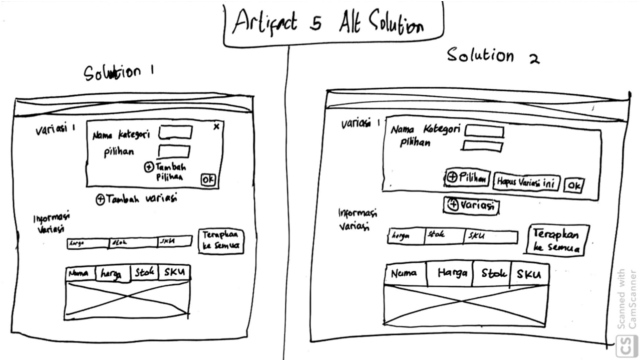

## Part A: Sketches

### 1. Scan/Photo of Sketches
---


---


---


---


---



---


---


---
### 2. Version Differences
#### 2.1 Solution for Problems in Artifact 0
**Solution 1** <br/>
Make the font size bigger <br/>
**Solution 2**<br/>
Make the font size bigger and place it near login/register button<br/>
**Solution 3**<br/>
Make an additional page to redirect user based on user's need (buy/sell)<br/>

#### 2.2 Solution for Problems in Artifact 1
**Solution 1**<br/>
Make the explanation text bolder<br/>
**Solution 2**<br/>
Move the explanation text from input box and make it as input box's name<br/>

#### 2.3 Solution for Problems in Artifact 2
**Solution 1**<br/>
Make the explanation text bolder<br/>
**Solution 2**<br/>
Move the explanation text from input box and make it as input box's name<br/>

#### 2.4 Solution for Problems in Artifact 3
**Solution 1**<br/>
Make registration button on the page header<br/>
**Solution 2**<br/>
Make registration button in the login's box<br/>

#### 2.5 Solution for Problems in Artifact 4
**Solution 1**<br/>
Show explanation text for every choice when the mouse hover over it.<br/>
**Solution 2**<br/>
Show the explanation of choice when the choice has been clicked.<br/>

#### 2.6 Solution for Problems in Artifact 5
**Solution 1**<br/>
Change "Nama" into "Nama Kategori, add an OK button to finalize user's input of "variasi". Remove field name "Daftar Variasi" and merge its content with "Informasi Variasi".<br/>
**Solution 2**<br/>
It is the same with Solution 1 with addition of "Hapus" button instead and cluster it with "OK" button.<br/>

#### 2.7 Solution for Problems in Artifact 6
**Solution**<br/>
Make combo box for every part of address ("Provinsi", "Kabupaten/Kota", etc) and an additional "Jalan" to specify the address.<br/>

#### 2.8 Solution for Problems in Artifact 8
**Solution**<br/>
Make border for both "Konfirmasi" and "Batal" button.<br/>

**Note: Solution for Artifact 7 is functional and will not be provided in sketch**

### 3. Selected Sketch and Design Rationale
**Artifact 1: Solution 2**<br/>
Many famous websites, i.e. facebook, twitter, etc., place their important button on the upper right side of page. It makes many people tend to look for upper right page when they search for something.<br/>
<br/>
**Artifact 2: Solution 2**<br/>
Even though Solution 1 is feasible, it is mostly used for devices with small screen (We limit our case to desktop version website).<br/>
<br/>
**Artifact 3: Solution 2**<br/>
When someone new want to login into website, they always look for login part in page. It is better for user to immediately find register button/hyperlink when they looking for login (Solution 1 can be implemented if the owner of the website want to go for consistency).<br/>
<br/>
**Artifact 4: Solution 1**<br/>
Using Solution 1, user can get the information of items faster than SOlution 2. In fact, Solution 2 may pose a problem for user that don't know the item explanation will be displayed after they click it.<br/> 
<br/>
**Artifact 5: Solution 2**<br/>
Solution 2 is more preferred because it's easier for user to get to know possible actions that can be made when the features are clustered (Solution 1 "Hapus Variasi" button placed far from "Ok" button).<br/>
<br/>
**Artifact 6: Solution**<br/>
It's mandatory for user to have control over information displayed. The original interface force the user to understand to choose "Provinsi" > "Kabupaten" > "Kecamatan" in succession. This solution breakdown the components so the user can understand faster how to fill the address without the need to click the button first.<br/> 
<br/>
**Artifact 8: Solution**<br/>
User must be able to understand the warning they got, including the user's choice provided by system. It makes the distinction between choice have to be clear for user. Solution provided makes user able to differentiate the choice displayed to them easier.<br/>
<br/>

## Part B: Assumptions
### 1. Hardware
```
1. Computer with minimum requirement: Intel Dual-Core@2GHz Intel HD Graphic 2GB RAM
2. Screen size: 15.6 inch
3. Screen resolution: higher than or equal to 960x720 and ratio 4:3
4. Using physical buttons or touch screen
```

### 2. Users
```
1. Familiar with using computer and web browser
2. The users' age are 16-25 years old
3. User never use Shopee
```

## Part C: Prototypes
-- coming soon --
