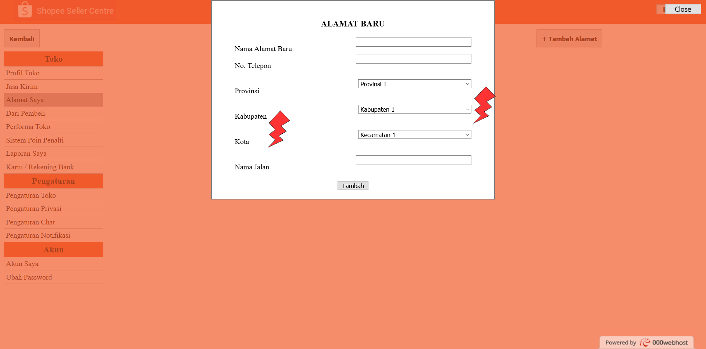

# Usability Evaluation
## User Task
The tasks are remain unchanged. Below are the tasks:
```
1. Sign Up
2. Log In
3. Open Seller Page
4. Make Product Information for Sale
5. Set/Change Shop Address
6. Set JNE Delivery Service On and J&T Delivery Service Off
```
## User Description
### Participant 1:
- User is a 19 years old Indonesian Female
- User never open the seller page of Shopee
- User study at Statistics Department ITS

### Participant 2: 
- User is a 23 years old Male
- User never use shopee at all
- User study at Informatics Departement ITS

### Participant 3: 
- User is a 22 years old Indonesian male
- User never open Shopee on website
- User study at Informatics department ITS

### Participant 4: 
- User is a 20 years old Indonesian male
- User never use Shopee
- User study at Informatics Department ITS

### Participant 5: 
- User is a 21 years old Indonesian male
- User never use Shopee
- User work at KPPBC Meulaboh

## Transcripts
### Participant #1 (....)
1. Lorem
2. Ipsum

### Participant #2 (Also interviewed on CI)
1. Ra : Ini nglanjut yang kemaren waktu itu yang ngetest shopee. Ini cuman prototype awal banget, jadi kalo jelek maafkan. Gapapa komentar dan kritik kalo memang ada.
2. R  : Ok ga masalah
3. Ra : Sekarang coba login dulu. Ga perlu masukin user password asli, cuman pura-pura aja. Terus kasih komentar gitu
4. R  : Oh ok. *klik tombol login*. Hmm ok done. Ga ada masalah.
5. Ra : Ga ada komentar kan? Lanjut bikin akun atau daftar.
6. R  : Ini pura-pura juga kan ya? *klik tombol daftar*. Ok ga ada masalah.
7. Ra : Ok gas masuk ke halaman buat jual
8. R  : Oh masih sama di atas ya (tombol "Jual"). Kalo misal dibuat kayak banner gitu bikin jelek?
9. Ra : Masih kurang bagus ya? Ini menurutku agak susah juga bikin solusinya gimana. Menurutmu banner yo biar gampang dilihat?
10. R : Iyo e. Masih agak susah kalo ibu-ibu yang nyari.
11. Ra: Okok, noted.
12. R : *berhasil masuk ke halaman seller*. Oh ini udah tombol buat daftar ya, boleh-boleh. *coba-coba login, dan berhasil* Oh cuman pura-pura juga yo. Ok wes lanjut lagi
13. Ra: Yoi. Sekarang buat produk baru buat dijual
14. R : *dengan lancar masuk ke halaman tambah produk, mulai ngisi detil produk*. Oh ini penjelasan singkat masalah style ya, ok lumayan. Tapi ini variasi malah aneh, susah.
15. Ra: Iya itu contoh penjelasan buat style-nya. Terus untuk yang variasi ini juga agak susah bikinnya, jadi sorry kalo belum bisa diperbaiki.
16. R : Oalah ok, sans. Rasanya bisa lanjut.
17. Ra: Ok. Coba edit ato set alamat tokomu.
18. R : *masuk ke halaman alamat toko, dan mencoba tambah alamat*. Udah ok sih, tapi untuk provinsi/kabupaten/kota menurutku kurang autocomplete aja. Mungkin di contoh ini cuma dikit ya, tapi kalo banyak kan tetep susah. Terus harusnya ini kabupaten ato kota, ga dua-duanya.
19. Ra: Iya ini nanti memang rencana ditambah autocomplete kok. Oh iya salah itu bos, sorry-sorry haha. Ok lanjut yo.
20. R : Ok lanjut ae
21. Ra: Coba kurir JNE dimatiin terus JNT aja yang bisa
22. R : *langsung berhasil melakukan task*. Mungkin kurang dikasih tombol save ta simpan gitu, biar usernya yakin aja.
23. Ra: Oh ya sip, thank you sarannya. Udah se itu aja tadi. Terima kasih banyak yo waktunya
24. R : Yoi gan sama-sama

### Participant #3 (New Participant)
1.	F : Sudah pernah menggunakan shopee ?
2.	S : Sudah kalau yang aplikasi android, kalau yang web belum pernah buka
3.	F : Oke, nah aku ini ada prototype awal buat website shopee
4.	S : Oke
5.	F : Sekarang, coba cari laman daftar
6.	S : Oke, sudah
7.	F : Mungkin ada masukan untuk tampilan daftarnya ?
8.	S : Tombol 'close' nya mungkin dipindah di dalam form, misal tanda silang di pojok kanan atas
9.	F : Oke, trus sekarang buka laman login
10.	S : oke, terus ?
11.	F : Gimana menurutmu ?
12.	S : Sama seperti laman daftar sih masalahnya. Lainnya sudah oke
13.	F : Oke, sekarang coba buka halaman jual
14.	S : Oke, wait
15.	S : Sudah, terus ?
16.	F : Ada kendala waktu mencari menu jual ?
17.	S : Tidak sih
18.	F : Oke, sekarang coba buat satu produk, produknya bebas
19.	S : Oke, bentar
20.	F : Oke
21.	S : Sudah
22.	F : Ada masukan atau kendala waktu mengisi detil produknya ?
23.	S : Tidak ada sih, mungkin bagian kolom style nya, kalau bisa gk usah dikasih keterangan. Soalnya menurutku sebagian besar orang yang mau belanja paham
24.	F : Oke, sekarang coba ganti alamat toko
25.	S : Oke, bentar
26.	F : Oke
27.	S : Sudah
28.	F : Ada masukan mungkin ?
29.	S : Tidak ada sih, mungkin sama kayak yang login sama daftar. tombol untuk kembalinya di taruh di form nya aja, yang lainnya aman
30.	F : Oke, terima kasih atas waktunya
31.	S : Yoi sama-sama


## Observations

### Observation #1

 - **Reference**: Transcript #2 Line number 8-10.
 - **Feedback**: Negative feedback.  
 - **Incidence**: None.  
 - **Reason**: Button is located at the top most page, and somehow small, making it quite hard to notice.
 - **Resolution**: We have not provided any solutions yet to this problem.
 
### Observation #2


 - **Reference**: Transcript #3 number 8,12,29.
 - **Feedback**: Negative feedback 
 - **Incidence**: -  
 - **Reason**: Button is located outside of form, maybe you can put it in the form
 - **Resolution**: Maybe we can add 'x' sign on the right corner
 
### Observation #3

 - **Reference**: Transcript #2 Line number 18.
 - **Feedback**: Negative feedback.  
 - **Incidence**: Participant was confused by "Kota" and "Kabupaten" input.  
 - **Reason**: "Kabupaten" and "Kota" is hierarchically similar term
 - **Resolution**: -
 
### Observation #4

 - **Reference**: Transcript #2 Line number 18.
 - **Feedback**: Negative feedback.  
 - **Incidence**: None.  
 - **Reason**: In the real scenario, the options to be selected are plenty, autocomplete helps.
 - **Resolution**: We'll add autocomplete for the dropdowns
 
### Observation #5

 - **Reference**: Transcript #3 number 23
 - **Feedback**: Negative feedback  
 - **Incidence**: -  
 - **Reason**: Most of people know the meaning of most 'style' words/category, so dont add more explanation
 - **Resolution**: We'll delete it
 
 ### Observation #6

 - **Reference**: Transcript #2 Line number 22.
 - **Feedback**: Neutral feedback.  
 - **Incidence**: None.  
 - **Reason**: No "Simpan" button.
 - **Resolution**: We'll add the button in the future
